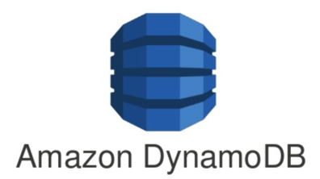

# GO projects with Amazon DynamoDB

## For better your work install:

### nodemon is for rebuilt your project in real time

    npm install -g nodemon

### dynamodb-admin is to monitor your DynamoDB

    npm install -g dynamodb-admin

    dynamodb-admin

## Run this project

### Copy envs

    make local-setup

### Install packages

    go install

### Create a vendor
    
    make vendor

### Run docker image

    docker-compose up -d

### Run your server

    make hot